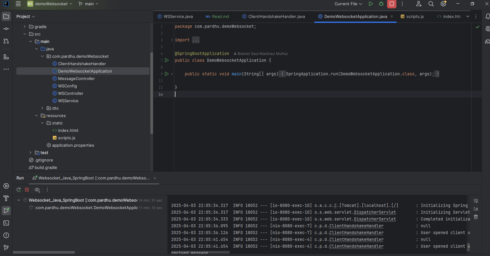
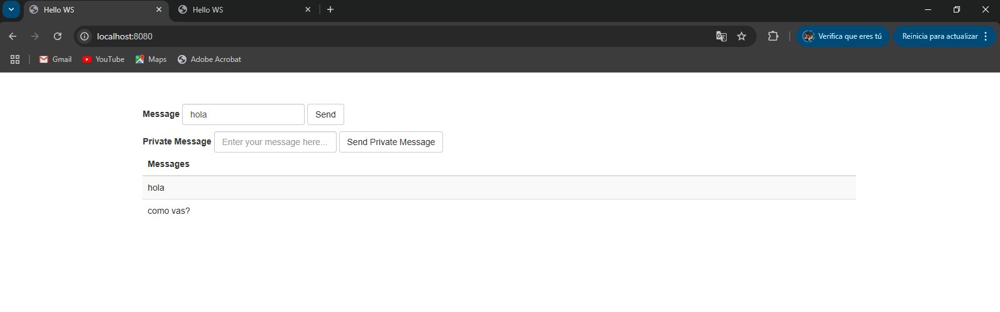
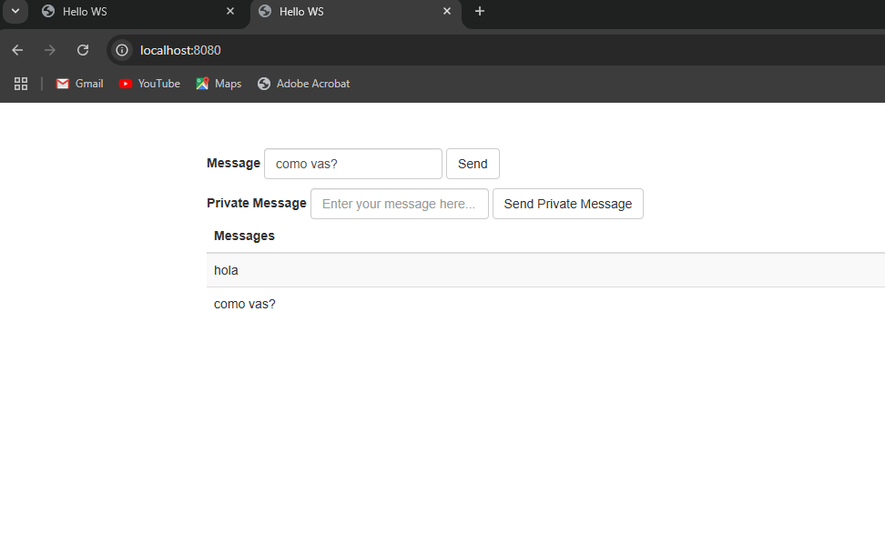

# Websocket con java y springboot framework ( chat )

### Para que el socket funcione correctamente:
- 1) Primero ejecutar la aplicacion springboot.
### Ejecucion de la aplicacion



- 2) Luego Ejecutar la pagina estatica en el navegador y duplicar la pagina, para simular el chat, utilizando el puerto:

http://localhost:8080/

# Chat 1


# chat 2



# Documentación del Sistema de WebSockets

## Tabla de Contenidos
1. [Introducción](#introducción)
2. [Arquitectura del Sistema](#arquitectura-del-sistema)
3. [Componentes Principales](#componentes-principales)
4. [Configuración](#configuración)
5. [Endpoints](#endpoints)
6. [Flujo de Mensajes](#flujo-de-mensajes)
7. [Frontend](#frontend)
8. [Requisitos](#requisitos)
9. [Instalación y Ejecución](#instalación-y-ejecución)

## Introducción

Este sistema implementa un servicio de mensajería en tiempo real utilizando WebSockets con Spring Boot. Proporciona funcionalidades para:

- Envío de mensajes públicos a todos los usuarios conectados
- Envío de mensajes privados a usuarios específicos
- Notificaciones globales y privadas
- Identificación única de clientes

## Arquitectura del Sistema


El sistema sigue una arquitectura cliente-servidor con los siguientes elementos clave:

1. **Cliente**: Navegador web con JavaScript
2. **Servidor**: Aplicación Spring Boot
3. **Protocolo**: STOMP sobre WebSockets
4. **Transporte**: SockJS como fallback

## Componentes Principales

### 1. ClientHandshakeHandler
Maneja el proceso de conexión inicial (handshake) asignando un ID único a cada cliente.

**Responsabilidades**:
- Generar identificadores únicos para clientes
- Registrar información de conexión
- Establecer el Principal para la sesión

### 2. WSConfig
Configuración central para WebSockets y STOMP.

**Configuraciones**:
- Habilita broker de mensajes simple
- Define prefijos para destinos
- Registra endpoint WebSocket con soporte para SockJS

### 3. MessageController
Maneja los mensajes entrantes a través de WebSockets.

**Métodos**:
- `getMessage`: Procesa mensajes públicos
- `getPrivateMessage`: Procesa mensajes privados

### 4. WSService
Servicio para enviar mensajes desde el servidor.

**Métodos**:
- `sendMessage`: Mensaje público
- `sendPrivateMessage`: Mensaje privado
- `sendNotification`: Notificación global
- `sendPrivateNotification`: Notificación privada

### 5. WSController
Controlador REST para enviar mensajes desde HTTP.

**Endpoints**:
- POST `/send-message`
- POST `/send-private-message/{id}`
- POST `/send-notification-global`
- POST `/send-notification-private/{id}`

## Configuración

### WebSocket
```java
@Configuration
@EnableWebSocketMessageBroker
public class WSConfig implements WebSocketMessageBrokerConfigurer {
    
    @Override
    public void configureMessageBroker(MessageBrokerRegistry registry) {
        registry.enableSimpleBroker("/receive");
        registry.setApplicationDestinationPrefixes("/ws");
    }

    @Override
    public void registerStompEndpoints(StompEndpointRegistry registry) {
        registry.addEndpoint("/websocket")
            .setHandshakeHandler(new ClientHandshakeHandler())
            .withSockJS();
    }
}
```

- **Broker**: Simple en memoria con prefijo `/receive`
- **Destinos de aplicación**: Prefijo `/ws`
- **Endpoint principal**: `/websocket` con soporte SockJS

## Endpoints

### WebSocket (STOMP)
| Destino | Tipo | Descripción |
|---------|------|-------------|
| `/ws/message` | Mensaje | Enviar mensaje público |
| `/ws/private-message` | Mensaje | Enviar mensaje privado |
| `/receive/message` | Suscripción | Recibir mensajes públicos |
| `/user/receive/private-message` | Suscripción | Recibir mensajes privados |
| `/receive/global-notification` | Suscripción | Recibir notificaciones globales |
| `/user/receive/private-notification` | Suscripción | Recibir notificaciones privadas |

### REST (HTTP)
| Método | Endpoint | Descripción |
|--------|----------|-------------|
| POST | `/send-message` | Enviar mensaje público |
| POST | `/send-private-message/{id}` | Enviar mensaje privado |
| POST | `/send-notification-global` | Enviar notificación global |
| POST | `/send-notification-private/{id}` | Enviar notificación privada |

## Flujo de Mensajes

### Mensaje Público
1. Cliente envía mensaje a `/ws/message`
2. Servidor procesa en `MessageController.getMessage`
3. Servidor envía a todos los suscritos a `/receive/message`

### Mensaje Privado
1. Cliente envía mensaje a `/ws/private-message`
2. Servidor procesa en `MessageController.getPrivateMessage`
3. Servidor envía solo al usuario destino en `/user/receive/private-message`

### Notificación desde HTTP
1. Cliente HTTP llama a endpoint REST (ej. `/send-notification-global`)
2. `WSController` delega a `WSService`
3. `WSService` usa `SimpMessagingTemplate` para enviar a suscriptores

## Frontend

### Estructura
- **Interfaz**: Formularios para mensajes públicos/privados
- **Historial**: Tabla que muestra mensajes recibidos
- **Notificaciones**: Contador visual de notificaciones no leídas

### Funciones JavaScript Principales
- `connect()`: Establece conexión WebSocket
- `sendMessage()`: Envía mensaje público
- `sendPrivateMessage()`: Envía mensaje privado
- `showMessage()`: Muestra mensaje en la tabla
- `updateNotificationDisplay()`: Actualiza contador de notificaciones

## Requisitos

### Tecnologías
- Java 8+
- Spring Boot 2.x
- SockJS
- STOMP
- jQuery (frontend)
- Bootstrap (frontend)

### Dependencias Gradle
```xml
<!-- Ejemplo de dependencias -->
        plugins {
        id 'org.springframework.boot' version '2.4.2'
        id 'io.spring.dependency-management' version '1.0.11.RELEASE'
        id 'java'
        }

        group = 'com.pardhu'
        version = '0.0.1-SNAPSHOT'
        sourceCompatibility = '15'

        repositories {
        mavenCentral()
        }

        dependencies {

        // SpringDoc OpenAPI (Documentación automática + Swagger UI)
        implementation("org.springdoc:springdoc-openapi-starter-webmvc-ui:2.5.0") // Usa la última versión


        implementation 'org.springframework.boot:spring-boot-starter-web'
        implementation 'org.springframework.boot:spring-boot-starter-websocket'
        testImplementation 'org.springframework.boot:spring-boot-starter-test'

        implementation 'org.webjars:webjars-locator-core'
        implementation 'org.webjars:sockjs-client:1.0.2'
        implementation 'org.webjars:stomp-websocket:2.3.3'
        implementation 'org.webjars:bootstrap:3.3.7'
        implementation 'org.webjars:jquery:3.1.1-1'

        testCompileOnly 'org.projectlombok:lombok:1.18.20'
        testAnnotationProcessor 'org.projectlombok:lombok:1.18.20'
        compileOnly 'org.projectlombok:lombok:1.18.20'
        annotationProcessor 'org.projectlombok:lombok:1.18.20'
        }

        tasks.named('test') {
        useJUnitPlatform()
        }

```

## Instalación y Ejecución

1. Clonar repositorio
2. Configurar dependencias (Maven/Gradle)
3. Ejecutar aplicación Spring Boot:
   ```bash
   mvn spring-boot:run
   ```
4. Acceder a `http://localhost:8080` en navegador

## Ejemplos de Uso

### Enviar mensaje público
```javascript
stompClient.send("/ws/message", {}, 
    JSON.stringify({'messageContent': 'Hola a todos!'}));
```

### Enviar mensaje privado
```javascript
stompClient.send("/ws/private-message", {}, 
    JSON.stringify({'messageContent': 'Hola en privado!'}));
```

### Enviar notificación desde HTTP
```bash
curl -X POST -H "Content-Type: application/json" -d '{"messageContent":"Nueva notificación"}' http://localhost:8080/send-notification-global
```

## Consideraciones

1. **Persistencia**: Los mensajes no se persisten, solo se envían a clientes conectados
2. **Escalabilidad**: El broker simple en memoria no es adecuado para múltiples instancias
3. **Seguridad**: No hay autenticación implementada en este ejemplo básico

## Mejoras Potenciales

1. Implementar autenticación y autorización
2. Añadir persistencia de mensajes
3. Configurar broker externo (RabbitMQ, ActiveMQ) para escalabilidad
4. Añadir soporte para salas/chat grupal
5. Implementar historial de mensajes